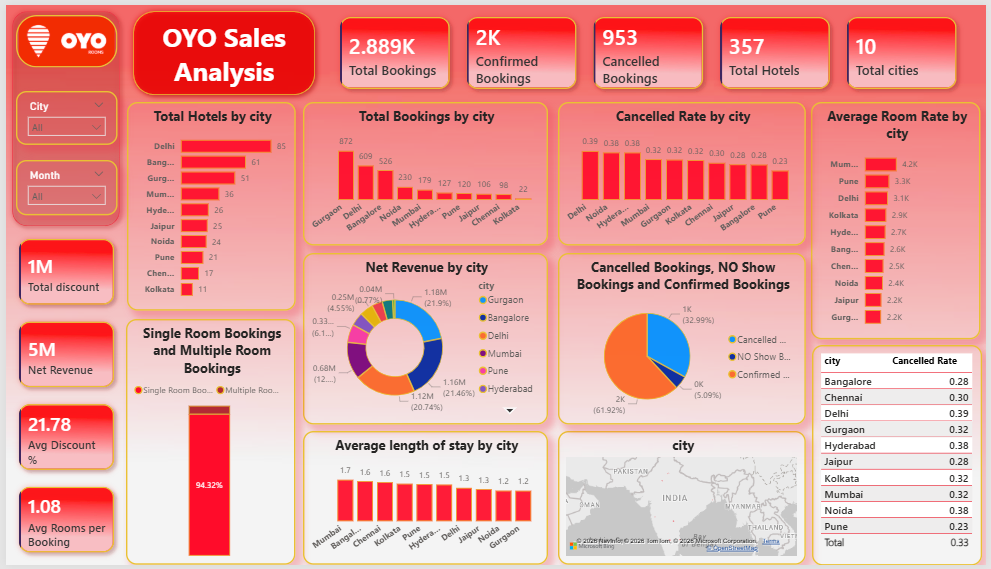

# 🏨 OYO Hotel Booking Analysis — SQL Project
                                                                                            -Gulshan Kumar
## Overview
SQL-based analysis of OYO hotel bookings covering:
- City-wise hotel distribution
- Booking & cancellation trends
- Revenue and discount analysis
- Customer behavior patterns

## Dataset
| Table | Description |
|-------|-------------|
| oyo_city | Hotel and city mapping |
| oyo_sales1 | Booking transactions (2891 records) |

## Tools Used
- MySQL

## 📊 Power BI Dashboard

An interactive Power BI dashboard was built on top of the SQL analysis.

### Dashboard Highlights
- KPI cards — Total Bookings, Confirmed, Cancelled, Hotels, Cities
- Total Hotels by City (bar chart)
- Total Bookings by City (bar chart)
- Cancellation Rate by City
- Average Room Rate by City
- Net Revenue by City (donut chart)
- Single vs Multiple Room Bookings
- Average Length of Stay by City
- Geospatial map of cities
- City and Month slicers for filtering

### Preview

